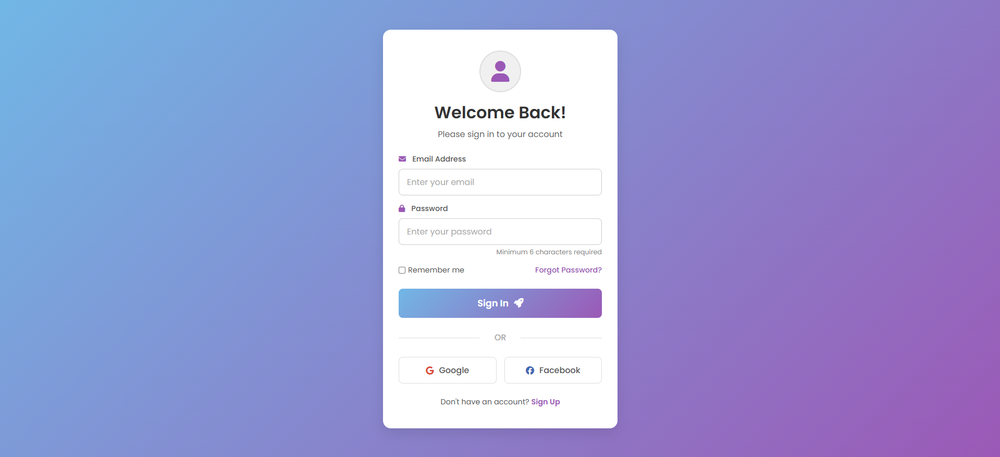

# Simple Login Page (HTML + CSS)

This is a responsive and modern login page built using only HTML and CSS. It includes a clean layout, smooth styling, and useful UI elements to simulate a realistic login interface.

## 🔍 What I Learned

During the creation of this project, I explored and practiced the following key concepts:

- ✅ **Font Awesome Integration**: Learned how to use external icon libraries like [Font Awesome](https://fontawesome.com/) to add visual icons inside forms and buttons.
- ✅ **Semantic HTML Elements**: Practiced using proper semantic tags that improve accessibility and SEO structure of the page.
- ✅ **Google Fonts Usage**: Understood how to embed custom fonts externally using [Google Fonts](https://fonts.google.com/), and apply them using CSS.
- ✅ **CSS Form Styling**: Gained experience in designing form elements using properties like `border-radius`, `box-shadow`, and `focus` states.
- ✅ **Transitions and Hover Effects**: Implemented smooth `hover` animations using `transition` for buttons and social links.
- ✅ **Background Gradients**: Learned how to apply linear gradients as background styles for visually appealing UI.
- ✅ **Text Styling and Decorations**: Used `text-decoration`, `font-weight`, and color properties to make interactive text stand out.

## 🛠 Technologies Used

- **HTML5** – For page structure and semantic layout  
- **CSS3** – For design, layout, transitions, responsiveness  
- **Font Awesome CDN** – For adding scalable icons  
- **Google Fonts** – For custom typography (`Poppins`)

## 📸 Preview

